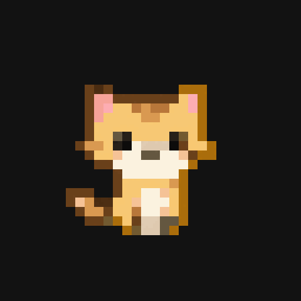

# Codex Desktop Cat Pet

基于 `tkinter` 的桌宠应用：实时监听本地 Codex 线程状态，为每个线程生成一只小猫，并根据状态播放不同动画。

## 特性

- 多线程监控：读取本机 `~/.codex/state_5.sqlite` 的最新线程。
- 精准状态识别：优先解析 `rollout jsonl` 中的 `task_started/task_complete`，并带超时兜底。
- 多猫并行：每个线程对应一只猫。
- 随机漫步：工作中在屏幕底部随机行走，且每只猫速度可随机。
- 左右朝向：向左移动自动镜像，向右保持原图。
- 三态动画：`working / completed / done`。
- 名字系统：默认 `chimi1/chimi2/...`，每只名字颜色不同。
- 交互：双击改名，右键可改名/调透明度/隐藏。
- 动作钩子：可配置进入工作、周期工作、完成时的提示音或命令执行。

## 目录结构

- `app.py`：主程序
- `config.json`：运行配置
- `assets/pet/`：可选本地资源目录（你也可以在配置中使用绝对路径）

## 快速开始

1. 准备 Python 3.11+（Windows）。
2. 配置 `config.json` 中的素材路径（例如 `working.png/completed.png/done.png`）。
3. 启动：

```powershell
& 'C:\Users\Lenovo\AppData\Local\Programs\Python\Python311\python.exe' 'E:\codex-desktop-buddy\app.py'
```

## 配置说明（重点）

### 1) 线程监听

- `db_path`：Codex 本地状态库路径。
- `monitor_thread_count`：同时扫描的最近线程数。
- `poll_interval_ms`：主循环轮询间隔（越小越灵敏）。
- `active_timeout_sec`：`task_started` 但长时间无更新时，判为完成的阈值。

### 2) 动画资源（sprites）

每个状态都支持两种资源形式（优先序列帧图，其次 GIF）：

- 序列帧图：
  - `working_sheet`, `working_sheet_cols`, `working_sheet_rows`
  - `completed_sheet`, `completed_sheet_cols`, `completed_sheet_rows`
  - `done_sheet`, `done_sheet_cols`, `done_sheet_rows`
- GIF：
  - `working_gif`, `completed_gif`, `done_gif`


```json
"sprites": {
  "working_gif": "assets/pet/working_gif.gif",
  "completed_gif": "assets/pet/completed_gif.gif",
  "done_gif": "assets/pet/done_gif.gif"
}
```


其他：

- `transparent_key`：透明色键（黑底素材通常用 `#000000`）。
- `sprite_scale`：放大倍数（像素风建议整数）。
- `completed_subsample` / `done_subsample`：缩小倍率（`2` 表示宽高减半）。

### 3) 移动与表现（motion）

- `bottom_walk_enabled`：是否启用底部行走。
- `bottom_margin`：离底部距离（越大越靠上）。
- `random_walk_enabled`：随机漫步。
- `turn_chance`：转向概率。
- `min_target_step` / `max_target_step`：每段随机目标步长。
- `random_speed_enabled`：每只猫速度随机。
- `cat_speed_min_px` / `cat_speed_max_px`：随机速度范围。
- `done_hold_ticks`：`done` 持续时长（tick 数）。
- `default_opacity`：默认透明度（0.2~1.0）。

### 4) 动作钩子（actions）

- `on_working_enter`
- `on_working_periodic`
- `on_completed`

每项支持：

- `beep`: `true/false`
- `command`: 命令字符串，可使用占位符 `{thread_id}`、`{title}`

## 交互说明

- 左键拖拽猫。
- 双击猫：修改名字。
- 右键菜单：修改名字 / 透明度 / 隐藏。

## 常见问题

1. 看不到猫
- 检查素材路径是否存在。
- 检查 `transparent_key` 是否和素材背景一致。

2. 状态卡在进行中
- 调整 `active_timeout_sec`（例如增大到 15~20）。

3. 动画太快或太慢
- 调整 `poll_interval_ms`。

4. 猫位置太高/太低
- 调整 `motion.bottom_margin`。


